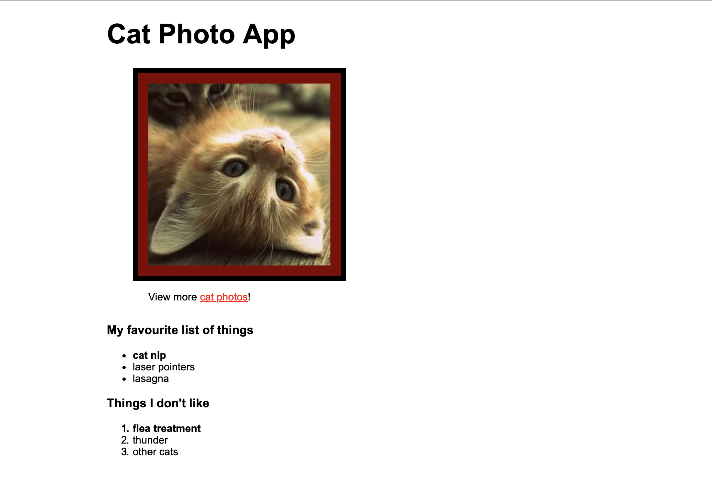


# Rhino

This assessment is in three parts, and can take up to three hours to complete.

## Semantic HTML

First, open [this link][rhino-semantic-html-page].

You'll need to **change five of the HTML tags** so they're more semantic. This might change the page's look slightly.

You'll also need to **explain why you chose each new tag**.

[rhino-semantic-html-page]: https://codepen.io/kjdchapman/pen/zXzQYw

## Basic CSS

You need to add styles to [this prepared HTML][rhino-unstyled-html-page], so that it looks like the picture below.

It doesn't need to be pixel perfect, but the whitespace around the content should look similar.

[rhino-unstyled-html-page]: https://codepen.io/kjdchapman/pen/mgwYKZ

## Accessibility

You'll need to **identify who** would find using each page difficult.

Next, you'll need to make a change to **make the page easier** to use.

Finally, you'll need to **explain why your changes make it better**.

These are the pages:

* [Example one][rhino-big-button]
* [Example two][rhino-delivery-healthchecks]
* [Example three][rhino-control-panel]
* [Example four][rhino-click-heres]
* [Example five][rhino-favourite-number]

[rhino-big-button]: https://codepen.io/anon/pen/YbQyEL
[rhino-delivery-healthchecks]: https://codepen.io/anon/pen/WBOQXV
[rhino-control-panel]: https://codepen.io/anon/pen/xNrZbW
[rhino-click-heres]: https://codepen.io/anon/pen/WBOQLb
[rhino-favourite-number]: https://codepen.io/anon/pen/YbQwbP


