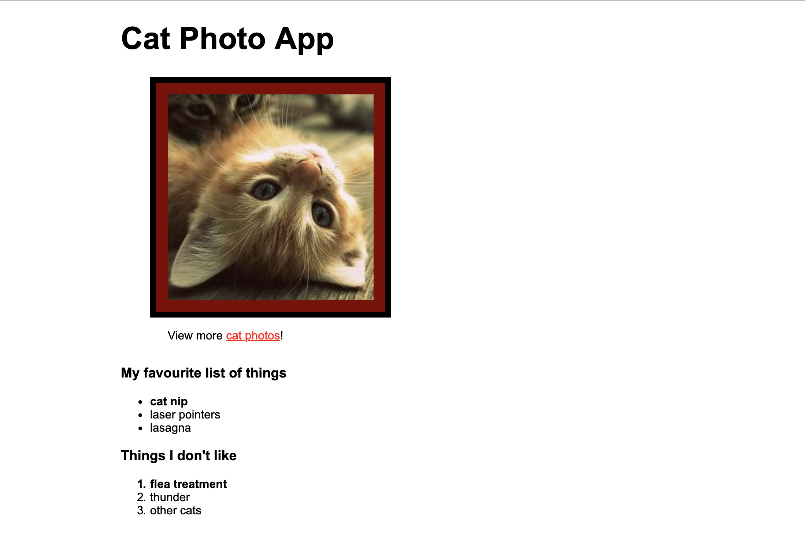

# Rhino

This assessment is in three parts, and can take up to three hours to complete.

## Semantic HTML

First, open [this link][rhino-semantic-html-page]. It's HTML and a preview of what it would look like in a browser.

You'll need to **change five of the HTML tags** so they're more semantic. This might change the page's look slightly.

You'll also need to **explain**, for each new tag, why you chose it.

[rhino-semantic-html-page]: https://codepen.io/kjdchapman/pen/zXzQYw

## Basic CSS

You need to produce a web page that looks like the picture below. It doesn't need to be pixel perfect, but the whitespace around the content should look similar.

You can either start from [this unstyled HTML][rhino-unstyled-html-page], or bring a pre-prepared page to the assessment.

[rhino-unstyled-html-page]: https://codepen.io/kjdchapman/pen/mgwYKZ

## Accessibility

You are giving a number of issues identified by an accessibility expert, you'll need to resolve each issue.

For each issue explain what kind of user would have trouble with the webpage,
and why your change made it easier for them.

* [Low contrast][rhino-bad-contrast]
* [Colour to communicate meaning][rhino-inaccessible-example]
* [Actions labelled by icons][rhino-inaccessible-example]
* [“Click here” link text][rhino-inaccessible-example]
* [Tiny button][rhino-inaccessible-example]

[rhino-bad-contrast]: https://codepen.io/anon/pen/RdEZyv
[rhino-inaccessible-example]: https://codepen.io/anon/pen/BbvdMy
