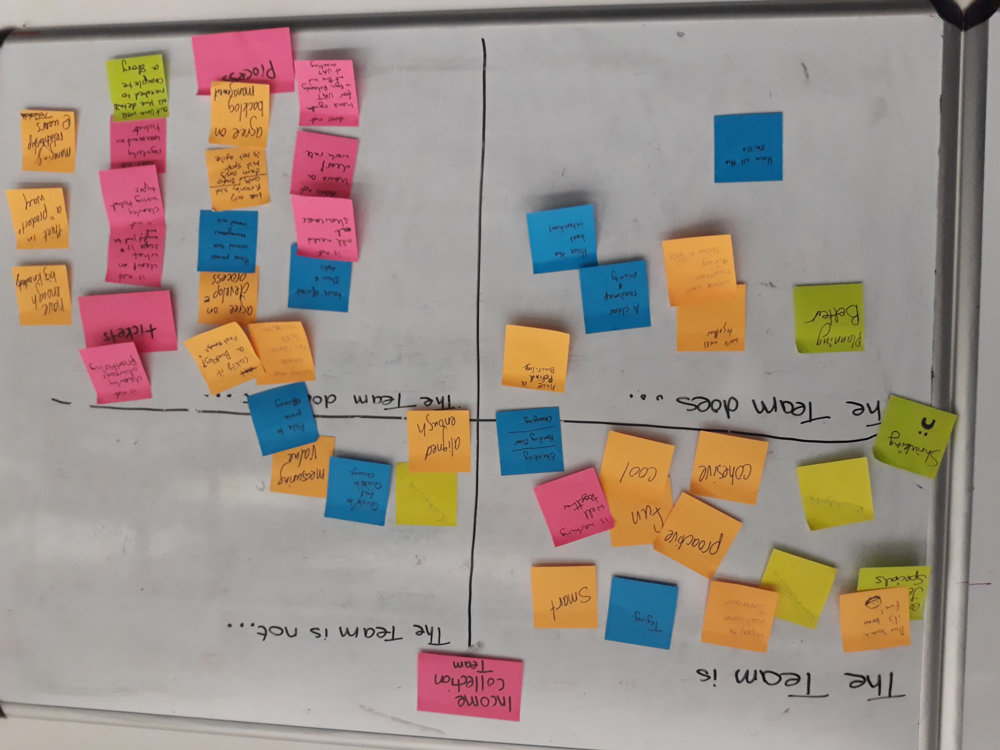
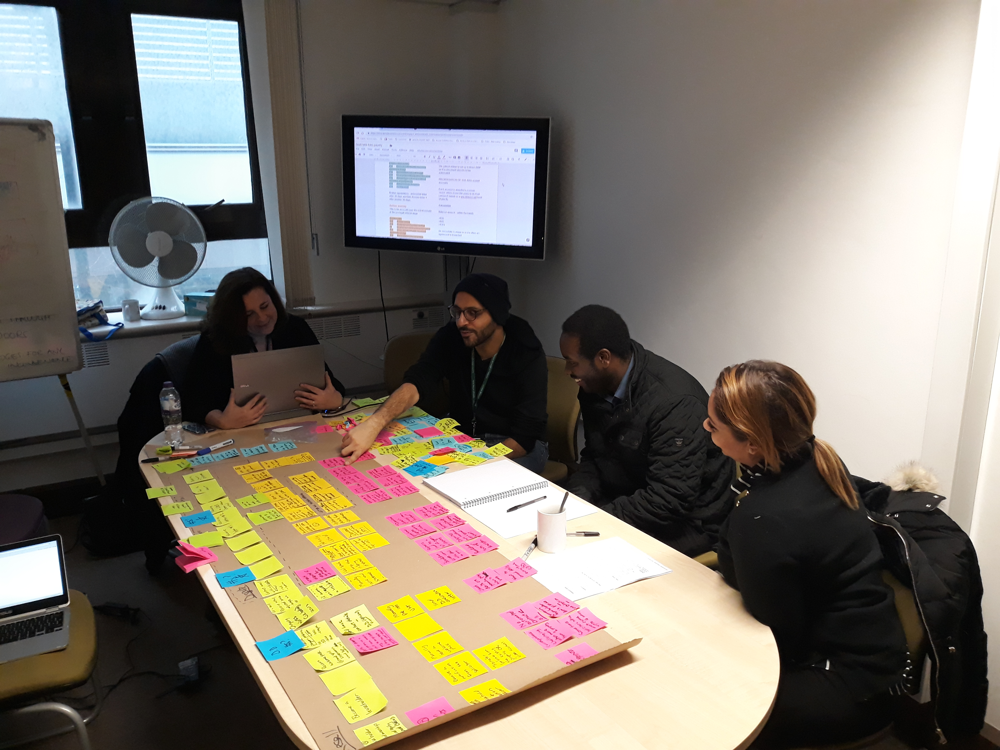
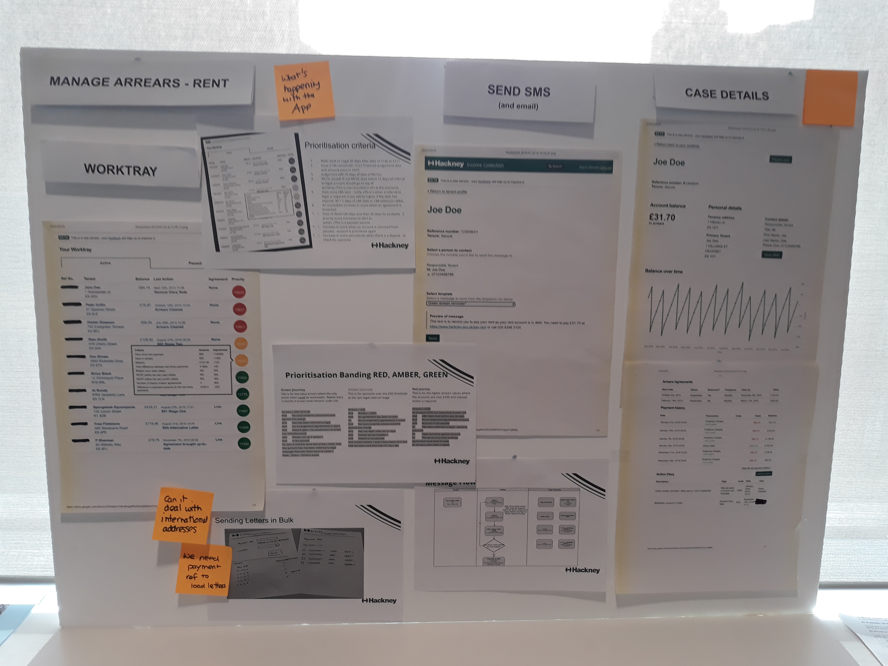
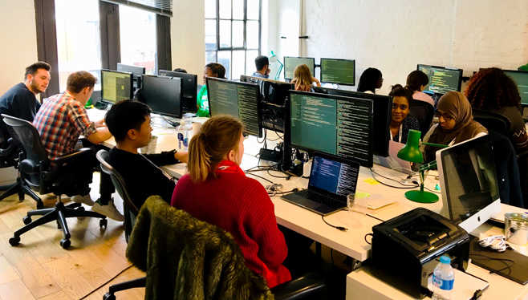

<heading>

Learn how to deliver digital services



Use these resources to empower your teams so that they can focus on delivering outcomes to meet user needs.




</heading>
  

    

      

        

          <h2>Delivering digital services</h2>
          
More organisations are using digital services to meet user needs. Whether a mobile banking app or applying for a passport online, organisations are providing their users the tools to solve their own needs. This is our methodology for delivering digital services which we hope is useful to you and your team.
        

    

  

  

    

      

        

          <h3 class="card-title">User-centred design and technology</h3>
          
Focussing on user needs enables us to deliver software that works for users while reducing the time spent on unnecessary features.
          

          <a href="https://www.madetech.com/blog/mob-programming-at-made" class="btn btn-success">Learn more</a>
        

      

    

    

      

        

          <h3 class="card-title">Combining product, design and technology</h3>
          
By bringing together product, design and technology into multi-disciplinary teams, we ensure that the digital services we build are viable, desirable and feasible.
          

          <a href="technology/core-skills" class="btn btn-success">Learn more</a>
        

      

    

    

      

        

          <h3 class="card-title">Continuous discovery and development</h3>
          
Discovery is not a phase. We must continue to use design and research to inform the digital services we are building to meet user needs.

          <a href="https://productionisation.io" class="btn btn-success">Learn more</a>
        

      

    

    

      

        

          <h3 class="card-title">Reliable and maintainable services</h3>
          
Digital services must continue to be invested in to meet changing needs rather than being built and then abandoned.

          <a href="https://www.madetech.com/blog/mob-programming-at-made" class="btn btn-success">Learn more</a>
        

      

    

  

<main>
  

    

      

        
      

      

        

          <h5 class="card-title">Delivery</h5>
            

              Delivery as a discipline is to deliver outcomes while considering the wellbeing and organisation of the team.
            

            

              To ensure the needs of users are met, continuous delivery is used. Continuous delivery is a practice which we use to provide value as quickly and efficiently as possible.
            

        

      

    

    

      

        

          <h5 class="card-title">Product</h5>
            

              Product is used to identify and prioritise needs as well as opportunities. In addition, product also aligns teams around outcomes.
            

            

              It is crucial that teams are aware of context and vision of the product in order to meet user needs. This will empower teams to maximise outcomes and impact.
            

        

      

      

        
      

    

    

      

        
      

      

        

          <h5 class="card-title">Design</h5>
           

              Design is framing the problem in order to understand user needs and existing/new digital services. User research is conducted to validate digital services to meet user needs.
            

            

              Digital services must be designed with users in mind alongside iterative user research. We consistently test our designs using prototypes.
            

        

      

    

    

      

        

          <h5 class="card-title">Technology</h5>
            

              Using technical approaches and architecture, technology is built to meet user needs. Digital service releases are incremental, maintainable and reliable.
            

            

              Digital services are simple and they meet user needs. Risk of change is reduced as digital services are reliable and scalable.
            

        

      

      

        
      

    

  

</main>
