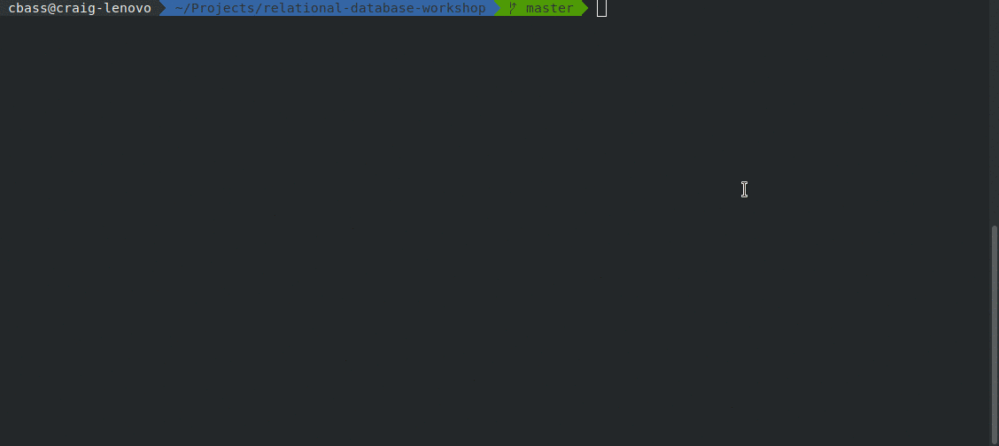

# Relational Databases

## Raw SQL

Lets explore databases by directly communicating with them.

We can do this using a command line tool.

For example, we can use the tool `pgcli`.

### Grab the premade sandbox

In your own time you can figure out how to install postgresql and pgcli.

For the purposes of this workshop we have provided a premade docker setup that provide an out of the box sandbox.

#### To Do

* Clone [madetech/relational-database-workshop](https://github.com/madetech/relational-database-workshop)
* Follow the README.



### Create a database

The sandbox environment comes out of the box with a database premade, called `workshop_one`.

You can also create your own database

```sql
CREATE DATABASE my_fancy_database;
```

By default you will be connected to `workshop_one` database.

You can `USE` your new database by doing the following

```sql
USE my_fancy_database;
```

This lets us execute queries against postgres without specifying the database in each query, which saves a lot of time.

### Create a table

In postgresql we can show all tables in our database using the following command

```sql
\dt
```

Now that we have a database we need to tell postgresql what our `schema` is.

Without a `schema`, we aren't able to store any data.

Let's define a simple table using the following query.

```sql
CREATE TABLE fruit ( 
  id SERIAL PRIMARY KEY,
  name VARCHAR NOT NULL 
);
```

* What does `PRIMARY KEY` mean?
* What does `VARCHAR` mean?
* What does `NOT NULL` mean?
* Why do you think we name the table singular `fruit` instead of `fruits`?

You can see this table by rerunning `\dt`. You should see something like the following:

```text
+------+-----+-----+--------+
|Schema|Name |Type |Owner   |
|------+-----+-----+--------|
|public|fruit|table|workshop|
+------+-----+-----+--------+
```

### Insert 

We don't have any data in our table yet because we just created it.

Lets go ahead and add a row:

```sql
INSERT INTO fruit ( name ) 
  VALUES (
    'Orange' 
  );
```

If you get an error about a missing column Orange, make sure you are using the correct quotes!

* Why do you think we don't need to specify a value for id?

### Select

We can then query this new row with a `SELECT` statement

```sql
SELECT * FROM fruit;
```

#### To Do

* Add a few more fruit using insert and run the `SELECT` again.

### Joins

Using a basic `SELECT` query we can fetch data from a single table.

If we want to include related data (_relational_), we can use a `JOIN` with our `SELECT`.

Assuming we still have some data in our `fruit` table from earlier...

Let's go ahead and create another table...

```sql
CREATE TABLE harvest ( 
  id SERIAL PRIMARY KEY,
  fruit_id INT NOT NULL REFERENCES fruit(id),
  date DATE NOT NULL,
  yield INT NOT NULL
);
```

and add a row...

```sql
INSERT INTO harvest ( fruit_id, date, yield ) 
  VALUES (
    1, '2018-01-01', 102919
  );
```

* What do you think that `REFERENCES fruit(id)` does?

Running another simple `SELECT` query should yield our new harvest.

```sql
SELECT * FROM harvest;
```

Unfortunately, `fruit_id` isn't very useful information - it would be more useful to have the name of the fruit in the result set.

One solution could be to do another query and manually join the tables together, but this isn't very efficient.

Instead, in postgres we can perform an `INNER JOIN` as part of a `SELECT` query (more on different join types soon) with the following sql

**Idiomatic PostgreSQL Syntax**

```sql
SELECT * FROM harvest, fruit
WHERE fruit.id = harvest.fruit_id;
```

**Alternative Syntax**

```
SELECT * FROM harvest
INNER JOIN fruit ON fruit.id = harvest.fruit_id;
```

* What do you think of the two syntax approaches?

Notice we use the `*` to which grabs all columns.

It is good practice to specify which columns you want to query. 

The main reason for this is that it's not possible to distinguish between columns with the same name (e.g. `harvest.id` and `fruit.id`) in the result set.
Another reason to limit columns is performance related (memory and cpu).


```sql
SELECT harvest.date, harvest.yield, fruit.name 
FROM harvest, fruit 
WHERE fruit.id = harvest.fruit_id; 
```

It is also possible to alias columns in the result set

```sql
SELECT 
  harvest.date as harvest_date, 
  harvest.yield as harvest_yield, 
  fruit.name as fruit_name 
FROM harvest, fruit 
WHERE fruit.id = harvest.fruit_id; 
```

#### Inner Join 

Go ahead and add five more fruit

```sql
INSERT INTO fruit ( name ) 
  VALUES ('Kiwi'), 
         ('Mango'), 
         ('Pineapple'), 
         ('Guava'), 
         ('Tomato');
```

Let's rerun our `INNER JOIN` from earlier...

```sql
SELECT 
  harvest.date as harvest_date, 
  harvest.yield as harvest_yield, 
  fruit.name as fruit_name 
FROM harvest, fruit 
WHERE fruit.id = harvest.fruit_id; 
```

* Do you notice that we only get results where there is both a fruit and a harvest.

Even if we make the "left hand" table `fruit` and use the alternative syntax the result is the same

```sql
SELECT 
  harvest.date as harvest_date, 
  harvest.yield as harvest_yield, 
  fruit.name as fruit_name 
FROM fruit 
INNER JOIN harvest ON fruit.id = harvest.fruit_id; 
```

This is because an `INNER JOIN` is the most restrictive type of join. 

#### Left Join

Lets say we wanted to get all fruit and their harvests (if they have one):

```sql
SELECT 
  harvest.date as harvest_date, 
  harvest.yield as harvest_yield, 
  fruit.name as fruit_name 
FROM fruit 
LEFT JOIN harvest ON fruit.id = harvest.fruit_id;
```

* What happened, and why did that happen?

What happens if you swap fruit and harvest tables?

```sql
SELECT 
  harvest.date as harvest_date, 
  harvest.yield as harvest_yield, 
  fruit.name as fruit_name 
FROM harvest
LEFT JOIN fruit ON fruit.id = harvest.fruit_id;
```

* What does that tell us about `LEFT` and what leftness means?

#### Right Join

```sql
SELECT 
  harvest.date as harvest_date, 
  harvest.yield as harvest_yield, 
  fruit.name as fruit_name 
FROM harvest
RIGHT JOIN fruit ON fruit.id = harvest.fruit_id;
```

Compare the results you get to the `LEFT JOIN` queries...

* What do you think `RIGHT` and rightness means?

#### Full Outer Join

Try out this query:

```sql
SELECT 
  harvest.date as harvest_date, 
  harvest.yield as harvest_yield, 
  fruit.name as fruit_name 
FROM harvest
FULL OUTER JOIN fruit ON fruit.id = harvest.fruit_id;
```
And this query

```sql
SELECT 
  harvest.date as harvest_date, 
  harvest.yield as harvest_yield, 
  fruit.name as fruit_name 
FROM fruit
FULL OUTER JOIN harvest ON fruit.id = harvest.fruit_id;
```

* What do you think `FULL OUTER JOIN` does?

### Altering tables

Suppose we want to adjust the schema to add an extra field `discontinued_on`

One solution could be to `DROP TABLE fruit;` and recreate, but this would delete the data contained within.

Instead we can use an `ALTER TABLE` query.

```sql
ALTER TABLE fruit
  ADD COLUMN discontinued_on DATE NULL
```

If we then do a simple `SELECT`

```sql
SELECT * FROM fruit;
```

We should see the new column. 

You can read all the options for `ALTER TABLE` at [postgresql.org/docs](https://www.postgresql.org/docs/current/static/sql-altertable.html).

### Indexes

If we use `WHERE` clauses to query subsets of information, we can greatly reduce the time taken to perform these queries by using appropriate indexes.

It is good practice to ensure there are indexes on any columns use in `WHERE` or `JOIN .. ON ...` clauses.

* By default `PRIMARY KEY` columns
* It **does not** create an index for any foreign key `REFERENCES`

We can list the indexes using this command

```sql
\di
```

We can add an index for `fruit_id` with this query

```sql
CREATE INDEX ON harvest (fruit_id);
```

#### Using Explain Analyse

If our tables contain very little data, postgres will automatically ignore any index and perform a basic "sequential scan" because that is quicker on small datasets.

We need to force postgres to use indexes. So lets first create lots of data (you'll need to make a dataset with roughly 1500 or more rows).

```sql
INSERT INTO fruit ( name ) 
  VALUES ('Kiwi'), 
         ('Mango'), 
         ('Pineapple'), 
         ('Guava'), 
         ('Tomato'),
         ('Kiwi'), 
         ('Mango'), 
         ('Pineapple'), 
         ('Guava'), 
         ('Tomato'),
         ... copy this many times ...
         ('Kiwi'), 
         ('Mango'), 
         ('Pineapple'), 
         ('Guava'), 
         ('Tomato');
```

**Hint:** You can find out the number of rows that you have created with this aggregate query

```sql
SELECT count(*) FROM fruit;
```

We can find out how postgres is going to "plan" to perform a query by prepending `EXPLAIN ANALYSE` to a query.

For example consider this query which uses our unindexed column `discounted_on`.

```sql
EXPLAIN ANALYSE SELECT * FROM fruit 
  WHERE discounted_on > '2020-01-01';
```

You will see postgres will plan with `Seq Scan on fruit`.

If you add an index to this column

```sql
CREATE INDEX ON fruit (discounted_on);
```

Now rerun the same `EXPLAIN ANALYSE`, you will see a plan with `Index Scan using fruit_discounted_on_idx on fruit` which is much more efficient.

Since postgres is so fast that even at 1500 rows, it's unlikely you will see any performance difference.

## In Ruby

We will be using a gem called `sequel` for the first part of this.

### Database Connections

### Migrations

### Querying

### Object-relational Mapping


* Wrapper libraries

* Sequel

* Migrations

* ORMs
